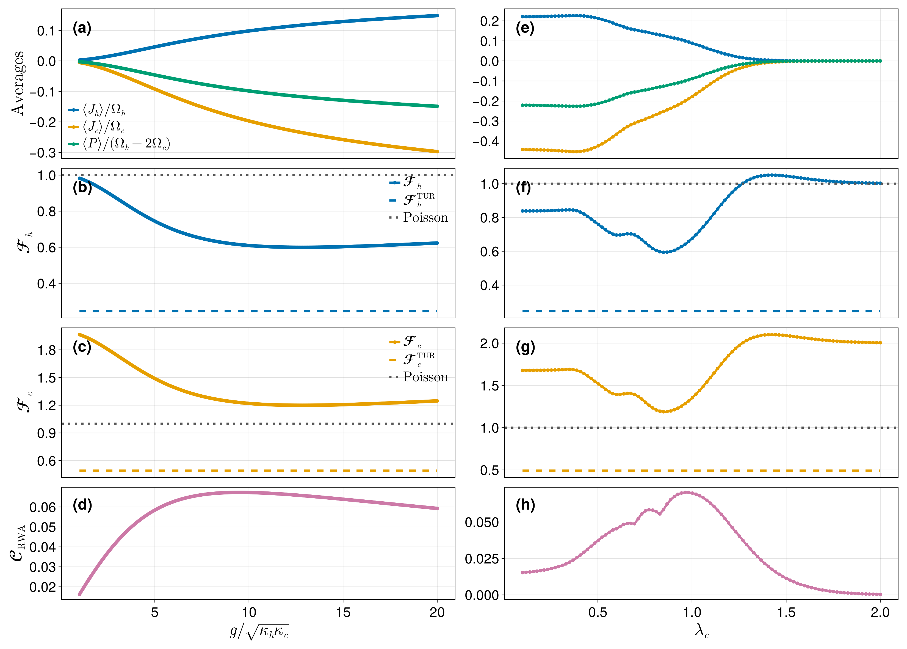

# [Circuit-QED quantum heat engine](@id qhe-example)

A voltage-biased Josephson junction couples a hot and a cold microwave mode. Each
Cooper pair tunnelling across the junction converts its electrostatic energy
``2eV`` into photons, and tuning the bias to

```math
2eV = l_h \Omega_h - l_c \Omega_c
```

selects which photon-exchange process is resonant. This example uses
``l_h = 1,\ l_c = 2``: **one hot photon in, two cold photons out**. In the
rotating-wave approximation,

```math
H = -\frac{E_J}{2}\left[\, i^{\,l_h+l_c}\,
    (a_c^\dagger)^{l_c}\, A_h(l_h)\, A_c(l_c)\, a_h^{l_h}
    + \text{h.c.} \right],
\qquad
E_J = \frac{2g}{(2\lambda_h)^{l_h}(2\lambda_c)^{l_c}},
```

where the ``A_\alpha`` are diagonal *Laguerre operators* carrying the junction's
nonlinear matrix elements and ``g`` is the effective photon–photon coupling. Each
mode is damped by its own thermal bath, giving four jump operators — emission into
and absorption from each bath:

```math
J = \Big[\sqrt{(\bar n_h+1)\kappa_h}\,a_h,\quad
        \sqrt{(\bar n_c+1)\kappa_c}\,a_c,\quad
        \sqrt{\bar n_h \kappa_h}\,a_h^\dagger,\quad
        \sqrt{\bar n_c \kappa_c}\,a_c^\dagger\Big].
```

We monitor **two** currents — the heat flowing into the hot bath and into the cold
bath — and compute the first two cumulants of each: the mean currents
``\langle J_\alpha\rangle`` and their noise
``\langle\langle J_\alpha^2\rangle\rangle``. From these follow the Fano factors,
the entropy production, and the thermodynamic-uncertainty-relation (TUR) product.

!!! note "Why this problem is a good fit for prepared contexts"
    Both heat currents live on the *same* Liouvillian and the *same* steady state.
    Only the monitored jumps and their weights differ. The Drazin solver depends
    on neither, so it can be prepared **once** and reused — which is exactly what
    [`prepare_fcs_context`](@ref) is for. This page is the worked example of the
    pattern described under
    [Reusing a prepared solver across observables](@ref prepared-context).

This page is a self-contained condensation of the companion notebook
[`circuit_qed_heat_engine.ipynb`](https://github.com/marcelojbp/QuantumFCS-Notebooks),
which reproduces Figs. 3 and 4 of the manuscript.

## Setup and parameters

```julia
using QuantumToolbox
using QuantumFCS
using Krylov, IncompleteLU          # enables the iterative backend
using SparseArrays, LinearAlgebra, Printf

params = (
    Nmax_h = 7,   Nmax_c = 7,        # Fock cutoffs: Hilbert dimension (Nmax_h+1)(Nmax_c+1)
    lh     = 1,   lc     = 2,        # one hot photon in, two cold photons out
    λh     = 0.47, λc    = 0.89,     # junction coupling parameters
    Ωc     = 1000.0, Ωratio = π,     # cold-mode frequency and Ω_h/Ω_c
    κh     = 2.0, κc     = 0.5,      # bath couplings
    nh     = 0.5, nc     = 0.01,     # thermal occupations
    g      = 12.841683366733466,     # effective photon-photon coupling
)
```

These are the operating parameters of the **large-affinity** regime, where the
engine turns out to be antibunched.

## Building the model

The Laguerre operators are diagonal in the Fock basis, with matrix elements

```math
\langle n | A_\alpha(k) | n \rangle
= (2\lambda)^k e^{-2\lambda^2}\, \frac{n!}{(n+k)!}\, L_n^{(k)}(4\lambda^2),
```

where ``L_n^{(k)}`` is a generalized Laguerre polynomial. Evaluating it with the
standard three-term recurrence

```math
(n+1)\,L_{n+1}^{(\alpha)}(x)
= (2n+1+\alpha-x)\,L_n^{(\alpha)}(x) - (n+\alpha)\,L_{n-1}^{(\alpha)}(x)
```

keeps this page dependency-free; the companion notebook instead evaluates the same
polynomial through the confluent hypergeometric function `pFq` from
`HypergeometricFunctions.jl`, and the two agree to machine precision. Note also
that ``n!/(n+k)!`` is written as ``1/\prod_{j=n+1}^{n+k} j`` rather than as a ratio
of factorials, which would overflow well before the cutoffs used in the
finite-affinity regime.

```julia
# Generalized Laguerre polynomial L_n^{(α)}(x), three-term recurrence.
function laguerre(n::Integer, α::Real, x::Real)
    n == 0 && return 1.0
    Lm1, L = 1.0, 1 + α - x
    for k in 1:(n - 1)
        Lm1, L = L, ((2k + 1 + α - x) * L - (k + α) * Lm1) / (k + 1)
    end
    return L
end

# ⟨n| A_α(k) |n⟩: the junction matrix element for a k-photon process.
laguerre_element(n, k, λ) =
    (2λ)^k * exp(-2λ^2) * laguerre(n, k, 4λ^2) / prod(n+1:n+k)

laguerre_operator(λ, k, N) = QuantumObject(
    spdiagm(0 => ComplexF64[laguerre_element(n, k, λ) for n in 0:(N - 1)]);
    type = Operator, dims = (N,))

function qhe_model(p)
    Nh, Nc = p.Nmax_h + 1, p.Nmax_c + 1
    ah = tensor(destroy(Nh), qeye(Nc))
    ac = tensor(qeye(Nh), destroy(Nc))

    Ej = 2 * p.g / ((2p.λh)^p.lh * (2p.λc)^p.lc)
    A  = tensor(laguerre_operator(p.λh, p.lh, Nh),
                laguerre_operator(p.λc, p.lc, Nc))

    H = -Ej / 2 * (im^(p.lh + p.lc) * (ac')^p.lc * A * ah^p.lh)
    H = H + H'

    J = [sqrt((p.nh + 1) * p.κh) * ah,     # emission into the hot bath
         sqrt((p.nc + 1) * p.κc) * ac,     # emission into the cold bath
         sqrt(p.nh * p.κh) * ah',          # absorption from the hot bath
         sqrt(p.nc * p.κc) * ac']          # absorption from the cold bath
    return (; H, J, ah, ac, Ej, dims = (Nh, Nc))
end

model = qhe_model(params)
Ωh = params.Ωratio * params.Ωc

@printf("Hilbert space: %d x %d = %d   (Liouvillian %d x %d)\n",
        params.Nmax_h + 1, params.Nmax_c + 1, prod(model.dims),
        prod(model.dims)^2, prod(model.dims)^2)
@printf("Ω_h = %.2f, Ω_c = %.2f, resonance 2eV = Ω_h - 2Ω_c = %.2f\n",
        Ωh, params.Ωc, Ωh - 2 * params.Ωc)
@printf("g = %.4f  ->  E_J = %.4f\n", params.g, model.Ej)
@printf("%d jump operators (hot/cold emission and absorption)\n", length(model.J))
```

```julia
Hilbert space: 8 x 8 = 64   (Liouvillian 4096 x 4096)
Ω_h = 3141.59, Ω_c = 1000.00, resonance 2eV = Ω_h - 2Ω_c = 1141.59
g = 12.8417  ->  E_J = 8.6235
4 jump operators (hot/cold emission and absorption)
```

## Two currents, one factorization

This is the part of the API worth seeing. Both heat currents are built from the
same four jump operators, weighted by the photon energy they carry:

- **hot current**: jumps `[J₁, J₃]` (emission into / absorption from the hot bath)
  with weights `[-Ω_h, +Ω_h]`;
- **cold current**: jumps `[J₂, J₄]` with weights `[-Ω_c, +Ω_c]`.

The sign convention makes ``\langle J_\alpha\rangle`` the heat flowing *into* bath
``\alpha``. Since the two currents differ only in `mJ` and `nu`, we prepare the
Drazin solver once with [`prepare_fcs_context`](@ref) and call
[`fcscumulants_recursive`](@ref) on that context for each current. Passing the
[`TraceConstrainedSteadyState`](@ref) straight into `prepare_fcs_context` also
hands over the preconditioner built during the steady-state solve, so the whole
point costs a **single** factorization no matter how many currents we ask for.

```julia
L  = liouvillian(model.H, model.J)

# Steady state: returns rho_ss *and* the ILU factorization built to get it.
ss = trace_constrained_steadystate(L;
    method       = :iterative,
    τ            = 1e-3,      # ILU drop tolerance
    shift_factor = 1e-6,      # diagonal shift keeping the factorization stable
    rtol = 1e-10, atol = 1e-14, itmax = 200, memory = 60)

# Prepare the Drazin solver once; `ss.Pl` is carried over, so no second ILU.
ctx = prepare_fcs_context(ss; method = :iterative,
                          τ = 0.05, rtol = 1e-8, itmax = 300, memory = 60)

# Same context, two different monitored currents.
hot  = fcscumulants_recursive(ctx; mJ = [model.J[1], model.J[3]],
                                   nu = [-Ωh, Ωh], nC = 2)
cold = fcscumulants_recursive(ctx; mJ = [model.J[2], model.J[4]],
                                   nu = [-params.Ωc, params.Ωc], nC = 2)

Jh, Dh = real(hot[1]),  real(hot[2])
Jc, Dc = real(cold[1]), real(cold[2])

@printf("hot :  ⟨J_h⟩ = %12.6g   ⟨⟨J_h²⟩⟩ = %12.6g\n", Jh, Dh)
@printf("cold:  ⟨J_c⟩ = %12.6g   ⟨⟨J_c²⟩⟩ = %12.6g\n", Jc, Dc)
@printf("steady state converged in %d iterations (ILU %.2f s, GMRES %.2f s)\n",
        ss.stats.iterations, ss.stats.ilu_seconds, ss.stats.gmres_seconds)
```

```julia
hot :  ⟨J_h⟩ =      369.612   ⟨⟨J_h²⟩⟩ =       696376
cold:  ⟨J_c⟩ =     -235.302   ⟨⟨J_c²⟩⟩ =       282231
steady state converged in 3 iterations (ILU 0.01 s, GMRES 1.04 s)
```

Heat flows in from the hot bath and out into the cold one, as the signs show.
Adding a third or fourth monitored current here would cost two more GMRES solves
each and no additional factorization at all.

## Consistency checks

Two identities must hold, and both are checked at every point of the sweeps below.

**Tight coupling.** Because every tunnelling event moves exactly ``l_h`` hot and
``l_c`` cold photons, the two heat currents are rigidly locked:

```math
l_c \Omega_c \langle J_h\rangle + l_h \Omega_h \langle J_c\rangle = 0 .
```

**Current identity.** The first FCS cumulant must equal the current computed
directly from the steady state as a weighted sum of jump rates,

```math
c_1 = \sum_k \nu_k \,\langle J_k^\dagger J_k\rangle ,
```

an independent route to the same number that exercises none of the Drazin
machinery.

```julia
ρss = QuantumObject(ss.rho_ss; type = Operator, dims = model.dims)

# The current straight from the steady state: Σ_k ν_k ⟨J_k† J_k⟩.
jump_current(ρ, jumps, weights) =
    sum(real(weights[k] * expect(jumps[k]' * jumps[k], ρ)) for k in eachindex(jumps))

hot_direct  = jump_current(ρss, [model.J[1], model.J[3]], [-Ωh, Ωh])
cold_direct = jump_current(ρss, [model.J[2], model.J[4]], [-params.Ωc, params.Ωc])

tight_coupling_error =
    abs(params.lc * params.Ωc * Jh + params.lh * Ωh * Jc) /
    max(abs(params.lc * params.Ωc * Jh), abs(params.lh * Ωh * Jc), eps())

@printf("tight coupling  l_c Ω_c ⟨J_h⟩ + l_h Ω_h ⟨J_c⟩ = 0  ->  rel. error %.2e\n",
        tight_coupling_error)
@printf("hot  current identity  c₁/direct − 1 = %.2e\n", Jh / hot_direct - 1)
@printf("cold current identity  c₁/direct − 1 = %.2e\n", Jc / cold_direct - 1)
```

```julia
tight coupling  l_c Ω_c ⟨J_h⟩ + l_h Ω_h ⟨J_c⟩ = 0  ->  rel. error 6.67e-10
hot  current identity  c₁/direct − 1 = 3.33e-15
cold current identity  c₁/direct − 1 = -3.33e-16
```

## Thermodynamics: affinity, Fano factors, and the TUR

The thermodynamic force driving the engine is the affinity

```math
\mathcal{A} = \frac{1}{l_h}\ln\!\left(\frac{1}{\bar n_c}+1\right)
            - \frac{1}{l_c}\ln\!\left(\frac{1}{\bar n_h}+1\right),
```

which sets the entropy production associated with each current,

```math
\sigma_h = l_c \frac{\langle J_h\rangle}{\Omega_h}\,\mathcal{A},
\qquad
\sigma_c = -l_h \frac{\langle J_c\rangle}{\Omega_c}\,\mathcal{A} .
```

The thermodynamic uncertainty relation states that the uncertainty product obeys

```math
Q_\alpha
= \frac{\langle\langle J_\alpha^2\rangle\rangle}{\langle J_\alpha\rangle^2}\,
  \sigma_\alpha \;\ge\; 2 .
```

Rewriting it as a bound on the Fano factor
``\mathcal{F}_\alpha = |\langle\langle J_\alpha^2\rangle\rangle /
(\Omega_\alpha \langle J_\alpha\rangle)|`` gives a threshold

```math
\mathcal{F}_h^{\mathrm{TUR}} = \frac{2}{l_c \mathcal{A}},
\qquad
\mathcal{F}_c^{\mathrm{TUR}} = \frac{2}{l_h \mathcal{A}} .
```

Here is the point of the large-affinity regime: that threshold drops **well below**
the Poisson value 1, so an engine can be strongly sub-Poissonian — antibunched —
and still respect the TUR.

```julia
𝒜  = log(1 / params.nc + 1) / params.lh - log(1 / params.nh + 1) / params.lc
σh = params.lc * (Jh / Ωh) * 𝒜
σc = -params.lh * (Jc / params.Ωc) * 𝒜

Fh = abs(Dh / (Ωh * Jh))
Fc = abs(Dc / (params.Ωc * Jc))
Qh = (Dh / Jh^2) * σh
Qc = (Dc / Jc^2) * σc

Fh_TUR = 2 / (params.lc * 𝒜)
Fc_TUR = 2 / (params.lh * 𝒜)

P_drive = Jh + Jc

@printf("affinity        𝒜 = %.4f\n", 𝒜)
@printf("hot  Fano       ℱ_h = %.4f      TUR threshold ℱ_h^TUR = %.4f\n", Fh, Fh_TUR)
@printf("cold Fano       ℱ_c = %.4f      TUR threshold ℱ_c^TUR = %.4f\n", Fc, Fc_TUR)
@printf("uncertainty     Q_h = %.4f,  Q_c = %.4f      (TUR bound: 2)\n", Qh, Qc)
@printf("output power    ⟨P⟩ = %.6g\n", P_drive)

if Fh < 1 && Qh > 2
    println("\n→ sub-Poissonian (ℱ_h < 1) yet Q_h > 2: antibunching without a TUR violation.")
end
```

```julia
affinity        𝒜 = 4.0658
hot  Fano       ℱ_h = 0.5997      TUR threshold ℱ_h^TUR = 0.2460
cold Fano       ℱ_c = 1.1994      TUR threshold ℱ_c^TUR = 0.4919
uncertainty     Q_h = 4.8767,  Q_c = 4.8767      (TUR bound: 2)
output power    ⟨P⟩ = 134.31

→ sub-Poissonian (ℱ_h < 1) yet Q_h > 2: antibunching without a TUR violation.
```

The hot current is sub-Poissonian at ``\mathcal{F}_h \approx 0.60`` while its TUR
threshold sits at ``0.246``: there is a factor of ``\sim\!2.4`` of room. Note that
``Q_h = Q_c`` exactly — a consequence of tight coupling, which makes the two
currents proportional and their uncertainty products identical.

## Sweeping parameters

Everything above, packaged for one parameter set, so a sweep is a `map` over it.
Each point rebuilds the Liouvillian and hence needs its own factorization — but
within a point, the steady state and both currents still share it.

```julia
function qhe_point(p)
    m  = qhe_model(p)
    Ωh = p.Ωratio * p.Ωc

    ss  = trace_constrained_steadystate(liouvillian(m.H, m.J);
        method = :iterative, τ = 1e-3, shift_factor = 1e-6,
        rtol = 1e-10, atol = 1e-14, itmax = 200, memory = 60)
    ctx = prepare_fcs_context(ss; method = :iterative,
                              τ = 0.05, rtol = 1e-8, itmax = 300, memory = 60)

    hot  = fcscumulants_recursive(ctx; mJ = [m.J[1], m.J[3]], nu = [-Ωh, Ωh], nC = 2)
    cold = fcscumulants_recursive(ctx; mJ = [m.J[2], m.J[4]], nu = [-p.Ωc, p.Ωc], nC = 2)
    Jh, Dh = real(hot[1]),  real(hot[2])
    Jc, Dc = real(cold[1]), real(cold[2])

    𝒜  = log(1 / p.nc + 1) / p.lh - log(1 / p.nh + 1) / p.lc
    σh = p.lc * (Jh / Ωh) * 𝒜
    σc = -p.lh * (Jc / p.Ωc) * 𝒜

    ρss = QuantumObject(ss.rho_ss; type = Operator, dims = m.dims)

    return (; p.g, p.λc, Ej = m.Ej, Jh, Dh, Jc, Dc, 𝒜,
              Fh = abs(Dh / (Ωh * Jh)), Fc = abs(Dc / (p.Ωc * Jc)),
              Qh = (Dh / Jh^2) * σh,    Qc = (Dc / Jc^2) * σc,
              Fh_TUR = 2 / (p.lc * 𝒜),  Fc_TUR = 2 / (p.lh * 𝒜),
              P_drive = Jh + Jc,
              diagnostics(ρss, m, p, Ωh, Jh, Jc)...)
end
```

The diagnostics recorded alongside every point are what makes the sweep
auditable — the truncation tails, the occupation fractions, the tight-coupling
error, and ``\varepsilon_{\text{off}}``, the size of the off-resonant terms the
RWA discards relative to their detuning ``\delta = |(\Omega_h/\Omega_c - 3)\Omega_c|``:

```julia
function diagnostics(ρss, m, p, Ωh, Jh, Jc)
    hot_pop  = max.(real.(diag(ptrace(ρss, 1).data)), 0.0);  hot_pop  ./= sum(hot_pop)
    cold_pop = max.(real.(diag(ptrace(ρss, 2).data)), 0.0);  cold_pop ./= sum(cold_pop)

    # Off-resonant terms the RWA discards, relative to their detuning.
    δ  = abs((p.Ωratio - 3) * p.Ωc)
    A0 = tensor(laguerre_operator(p.λh, 0, p.Nmax_h + 1),
                laguerre_operator(p.λc, 1, p.Nmax_c + 1))
    F  = -m.Ej / 2 * (im * m.ac * A0)
    ε_off = sqrt(max(real(expect(F * F' + F' * F, ρss)), 0.0)) / δ

    return (; hot_tail  = sum(hot_pop[end-1:end]),
              cold_tail = sum(cold_pop[end-1:end]),
              hot_occupation  = sum((0:p.Nmax_h) .* hot_pop) / p.Nmax_h,
              cold_occupation = sum((0:p.Nmax_c) .* cold_pop) / p.Nmax_c,
              ε_off,
              tight_coupling_error =
                  abs(p.lc * p.Ωc * Jh + p.lh * Ωh * Jc) /
                  max(abs(p.lc * p.Ωc * Jh), abs(p.lh * Ωh * Jc), eps()))
end
```

Two sweeps at fixed bath parameters: one over the coupling ``g`` at
``\lambda_c = 0.89``, one over ``\lambda_c`` at the selected ``g``. The
``\lambda_c`` sweep needs a slightly larger cold cutoff. At 64 dimensions a point
costs tens of milliseconds, so both sweeps finish in well under a minute.

```julia
# Wrapped in a function: keeps the loop type-stable and lets a sweep be rerun.
function qhe_sweep(base, values, setter; label = "sweep", progress_every = 50)
    rows = NamedTuple[]
    t0 = time_ns()
    for (i, v) in enumerate(values)
        pt = qhe_point(merge(base, setter(v)))
        push!(rows, pt)
        if i == 1 || i == length(values) || i % progress_every == 0
            @printf("%-12s %3d/%3d  x=%7.4f | ℱ_h=%7.4f ℱ_c=%7.4f Q_h=%7.3f | tails %.1e/%.1e | %5.1fs\n",
                    label, i, length(values), v, pt.Fh, pt.Fc, pt.Qh,
                    pt.hot_tail, pt.cold_tail, (time_ns() - t0) / 1e9)
        end
    end
    return rows
end

sweep_g = qhe_sweep(params, LinRange(1.0, 20.0, 200), v -> (; g = v);
                    label = "g sweep", progress_every = 40)

sweep_λc = qhe_sweep(merge(params, (; Nmax_c = 10)), LinRange(0.1, 2.0, 60),
                     v -> (; λc = v); label = "λc sweep", progress_every = 12)

best = sweep_g[argmin(r.Fh for r in sweep_g)]
@printf("\nmin ℱ_h over the g sweep: %.4f at g = %.3f  (TUR threshold %.4f)\n",
        best.Fh, best.g, best.Fh_TUR)
```

```julia
g sweep        1/200  x= 1.0000 | ℱ_h= 0.9825 ℱ_c= 1.9651 Q_h=  7.990 | tails 1.2e-03/2.7e-10 |   0.7s
g sweep       40/200  x= 4.7236 | ℱ_h= 0.7598 ℱ_c= 1.5196 Q_h=  6.178 | tails 1.2e-03/2.2e-07 |   3.9s
g sweep       80/200  x= 8.5427 | ℱ_h= 0.6274 ℱ_c= 1.2549 Q_h=  5.102 | tails 1.1e-03/3.3e-06 |   6.6s
g sweep      120/200  x=12.3618 | ℱ_h= 0.5999 ℱ_c= 1.1999 Q_h=  4.878 | tails 1.0e-03/1.6e-05 |   8.9s
g sweep      160/200  x=16.1809 | ℱ_h= 0.6069 ℱ_c= 1.2139 Q_h=  4.935 | tails 1.0e-03/4.4e-05 |  11.4s
g sweep      200/200  x=20.0000 | ℱ_h= 0.6234 ℱ_c= 1.2468 Q_h=  5.069 | tails 9.9e-04/9.4e-05 |  14.0s
λc sweep       1/ 60  x= 0.1000 | ℱ_h= 0.8384 ℱ_c= 1.6769 Q_h=  6.818 | tails 7.8e-04/7.6e-04 |   0.4s
λc sweep      12/ 60  x= 0.4542 | ℱ_h= 0.7993 ℱ_c= 1.5985 Q_h=  6.499 | tails 8.4e-04/9.9e-06 |   2.9s
λc sweep      24/ 60  x= 0.8407 | ℱ_h= 0.5949 ℱ_c= 1.1898 Q_h=  4.838 | tails 1.0e-03/3.9e-08 |   4.5s
λc sweep      36/ 60  x= 1.2271 | ℱ_h= 0.9638 ℱ_c= 1.9276 Q_h=  7.837 | tails 1.2e-03/2.9e-11 |   6.1s
λc sweep      48/ 60  x= 1.6136 | ℱ_h= 1.0285 ℱ_c= 2.0570 Q_h=  8.363 | tails 1.2e-03/2.9e-14 |   8.1s
λc sweep      60/ 60  x= 2.0000 | ℱ_h= 1.0027 ℱ_c= 2.0051 Q_h=  8.153 | tails 1.2e-03/1.3e-16 |   8.9s

min ℱ_h over the g sweep: 0.5997 at g = 12.839  (TUR threshold 0.2460)
```

The hot Fano factor dips to ``\approx 0.60`` — clearly sub-Poissonian — while its
TUR threshold sits near ``0.25``. The engine is antibunched with room to spare
above the bound, and the sweep locates the optimum at the ``g`` used for the
manuscript's operating point.

## Validation

The RWA and the Fock truncation both have to be checked before the physics can be
believed.

```julia
function validation_summary(rows, xs, label; ε_tol = 0.05)
    ok = [r.ε_off < ε_tol for r in rows]
    @printf("%-9s | %3d/%3d points satisfy ε_off < %.2f | ε_off ∈ [%.1e, %.1e]\n",
            label, count(ok), length(rows), ε_tol,
            minimum(r.ε_off for r in rows), maximum(r.ε_off for r in rows))
    @printf("          | tails: hot ≤ %.1e, cold ≤ %.1e | tight coupling ≤ %.1e\n",
            maximum(r.hot_tail for r in rows), maximum(r.cold_tail for r in rows),
            maximum(r.tight_coupling_error for r in rows))
    all(ok) || @printf("          | RWA marginal for x ∈ [%.3f, %.3f]\n",
                       minimum(xs[.!ok]), maximum(xs[.!ok]))
end

validation_summary(sweep_g,  [r.g  for r in sweep_g],  "g sweep")
validation_summary(sweep_λc, [r.λc for r in sweep_λc], "λc sweep")
```

```julia
g sweep   | 200/200 points satisfy ε_off < 0.05 | ε_off ∈ [2.7e-04, 6.6e-03]
          | tails: hot ≤ 1.2e-03, cold ≤ 9.4e-05 | tight coupling ≤ 2.0e-08
λc sweep  |  52/ 60 points satisfy ε_off < 0.05 | ε_off ∈ [3.5e-05, 4.2e-01]
          | tails: hot ≤ 1.2e-03, cold ≤ 8.2e-04 | tight coupling ≤ 7.3e-06
          | RWA marginal for x ∈ [0.100, 0.325]
```

The ``g`` sweep is clean throughout: ``\varepsilon_{\text{off}}`` stays below
``10^{-2}`` at every point, truncation tails are at the ``10^{-3}`` level, and
tight coupling holds to ``\sim\!10^{-8}``.

The ``\lambda_c`` sweep is only trustworthy above ``\lambda_c \approx 0.33``. This
is not a numerical problem but a physical one: holding ``g`` fixed while shrinking
``\lambda_c`` requires ``E_J = g/(4\lambda_h\lambda_c^2)`` to grow without bound,
so the off-resonant terms the RWA discards stop being small. The cutoffs remain
perfectly adequate there — it is the *model*, not the solver, that degrades. The
operating point used above, ``\lambda_c = 0.89``, sits comfortably inside the
valid region.

## Cutoff convergence

The Fock cutoffs here are fixed rather than scheduled (unlike the
[Jaynes–Cummings example](@ref jc-example)), so they need justifying. Recompute
one point on a ladder of cutoffs and watch the relative change from one rung to
the next:

```julia
function cutoff_convergence(base, cutoffs)
    prev = nothing
    println(" Nmax_h  Nmax_c        J_h        ℱ_h        ℱ_c   ΔJ_h/J_h   Δℱ_h/ℱ_h   hot tail  cold tail")
    for (Nh, Nc) in cutoffs
        r  = qhe_point(merge(base, (; Nmax_h = Nh, Nmax_c = Nc)))
        dJ = prev === nothing ? NaN : abs(r.Jh / prev.Jh - 1)
        dF = prev === nothing ? NaN : abs(r.Fh / prev.Fh - 1)
        @printf("%7d %7d %10.6g %10.6f %10.6f %10.1e %10.1e %10.1e %10.1e\n",
                Nh, Nc, r.Jh, r.Fh, r.Fc, dJ, dF, r.hot_tail, r.cold_tail)
        prev = r
    end
end

cutoff_convergence(params, [(5, 5), (7, 7), (9, 9), (11, 11)])
```

```julia
 Nmax_h  Nmax_c        J_h        ℱ_h        ℱ_c   ΔJ_h/J_h   Δℱ_h/ℱ_h   hot tail  cold tail
      5       5    369.354   0.597924   1.195848        NaN        NaN    9.2e-03    6.2e-03
      7       7    369.612   0.599720   1.199439    7.0e-04    3.0e-03    1.0e-03    1.8e-05
      9       9    369.569   0.599676   1.199353    1.1e-04    7.2e-05    1.2e-04    2.5e-07
     11      11    369.565   0.599677   1.199353    1.3e-05    4.2e-07    1.3e-05    1.2e-09
```

The changes fall by orders of magnitude as the cutoff grows, and the production
cutoff ``N_{\max} = 7`` already sits in the converged region: going to ``11``
changes ``\mathcal{F}_h`` in the fifth decimal, far below anything the figures
claim.

## The manuscript figure



The published figure runs the two sweeps above at full resolution and shows the
scaled heat currents and output power (a, e), the hot and cold Fano factors
against their TUR thresholds and the Poisson line (b, c, f, g), and the RWA
coherence (d, h).

A second regime, not reproduced here, lowers the affinity by warming the cold bath
(``\bar n_h = 2.5``, ``\bar n_c = 1.5``). That raises the TUR thresholds far above
1 and lets the engine be pushed close to the bound ``Q \approx 2`` —
near-reversible operation with small currents. It needs much larger cutoffs
(``N_{\max,h} = 20``, ``N_{\max,c} = 25``, a 546-dimensional Hilbert space), which
is where the iterative backend starts to matter for this model too. Both regimes,
the figure routines, and the checked-in sweep data live in the companion
repository [QuantumFCS-Notebooks](https://github.com/marcelojbp/QuantumFCS-Notebooks).

## See also

- [Driven-dissipative Jaynes–Cummings model](@ref jc-example) — one current, but
  a Liouvillian four orders of magnitude larger, with preconditioner reuse carried
  across a parameter sweep.
- [Reusing a prepared solver across observables](@ref prepared-context) — the
  general form of the multi-current pattern used here.
