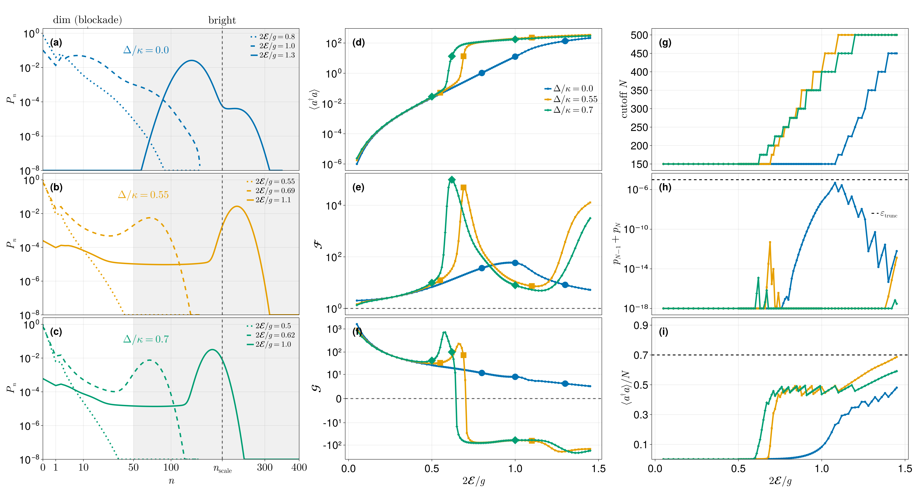

# [Driven-dissipative Jaynes–Cummings model](@id jc-example)

A coherently driven cavity coupled to a two-level atom, with cavity loss only. In
the frame rotating at the drive frequency,

```math
H = -\Delta\,(a^\dagger a + \sigma_+\sigma_-)
    + g\,(a^\dagger\sigma_- + a\,\sigma_+)
    - \mathcal{E}\,(a + a^\dagger),
\qquad
\dot\rho = -i[H,\rho] + \kappa\,\mathcal{D}[a]\rho ,
```

with ``\Delta`` the common cavity/atom detuning from the drive, ``g`` the
Jaynes–Cummings coupling, ``\mathcal{E}`` the drive amplitude, and ``\kappa`` the
cavity linewidth (which sets the unit of energy throughout).

We count the **cavity emission** ``\kappa\,a\rho a^\dagger`` — a single monitored
jump with weight ``+1`` — and compute the first three cumulants of the
emitted-photon counting statistics:

```math
\frac{c_1}{\kappa} = \langle a^\dagger a\rangle,
\qquad
\mathcal{F} = \frac{c_2}{c_1},
\qquad
\mathcal{G} = \frac{c_3}{c_2^{3/2}} ,
```

the count rate, the Fano factor, and the skewness. Sweeping the dimensionless
drive ``x = 2\mathcal{E}/g`` at fixed ``g/\kappa = 14`` crosses the
**photon-blockade breakdown**. On the detuned cuts the cavity becomes bimodal —
a dim, blockaded state coexisting with a bright, lasing-like one — and the
emission is strongly intermittent, which the higher cumulants register far more
sharply than the mean does.

!!! note "Why this problem needs the iterative backend"
    The bright branch carries hundreds of photons, so the Fock cutoff must grow
    with the drive. At ``N = 500`` the Liouvillian is a ``\sim\!10^6 \times 10^6``
    sparse non-Hermitian matrix: forming an LU factorization of it is hopeless,
    and every point needs a steady state *and* three Drazin solves. This page is
    a worked example of the [iterative backend](@ref solvers) — in particular of
    building **one** incomplete-LU factorization per parameter neighbourhood and
    using it for everything.

This page is a self-contained condensation of the companion notebook
[`driven_dissipative_jaynes_cummings.ipynb`](https://github.com/aarondanielphysics/QuantumFCS-Notebooks),
which reproduces Fig. 2 of the manuscript.

## Setup

```julia
using QuantumToolbox
using QuantumFCS
using Krylov, IncompleteLU          # enables the iterative backend
using SparseArrays, LinearAlgebra, Printf
```

!!! note "QuantumToolbox version"
    The results on this page were produced with QuantumToolbox 0.28. Nothing in
    `QuantumFCS` depends on that version — the package only reads `.data` off
    whatever operators you pass — but `QuantumToolbox`'s own
    `QuantumObject(...; type = Operator, dims = ...)` constructor changed in later
    0.4x releases (`Operator` became a type rather than a singleton value, and a
    super-operator's `.dimensions` now reports Liouville-space dimensions). On a
    newer QuantumToolbox, construct the state with that release's spelling and pass
    the Hilbert-space factor sizes — here `(N + 1, 2)` — instead of `L.dimensions`.

The operators are built once for a given Fock cutoff `N`. The two Hamiltonian
pieces that a sweep rescales — the Jaynes–Cummings coupling and the drive — are
returned separately, so a sweep can rebuild `H` cheaply while the operators stay
fixed.

```julia
const g = 14.0     # Jaynes-Cummings coupling, in units of κ
const κ = 1.0      # cavity linewidth sets the unit

# Cavity + atom operators at Fock cutoff N (Hilbert dimension 2(N+1)).
function jc_operators(N)
    a  = tensor(destroy(N + 1), qeye(2))
    sm = tensor(qeye(N + 1), sigmam())
    return (; a, sm,
              Hjc         = a' * sm + a * sm',      # a†σ₋ + aσ₊
              Hdr         = -(a + a'),              # -(a + a†)
              n_op        = a' * a,
              detuning_op = a' * a + sm' * sm)
end

# The Hamiltonian at one (Δ, E) point is a linear combination of those pieces.
jc_hamiltonian(ops, Δ, g, E) = -Δ * ops.detuning_op + g * ops.Hjc + E * ops.Hdr

N_demo = 150
ops = jc_operators(N_demo)
cavity_loss = sqrt(κ) * ops.a      # the single jump operator, and the counted channel

@printf("cutoff N = %d  ->  Hilbert dim = %d, Liouvillian %d x %d\n",
        N_demo, 2 * (N_demo + 1), (2 * (N_demo + 1))^2, (2 * (N_demo + 1))^2)
```

```julia
cutoff N = 150  ->  Hilbert dim = 302, Liouvillian 91204 x 91204
```

## One point, start to finish

This is the whole `QuantumFCS` call sequence for a single drive point.

1. [`trace_constrained_system`](@ref) replaces the singular condition
   ``\mathcal{L}\rho = 0`` with a non-singular linear system by imposing
   ``\operatorname{tr}\rho = 1``.
2. [`trace_constrained_steadystate`](@ref) solves it with GMRES preconditioned by
   a shifted incomplete-LU factorization, and **returns that factorization** in
   `ss.Pl`.
3. [`LindbladFCS`](@ref) with `Pl = ss.Pl` hands the *same* factorization to the
   Drazin-inverse solves inside the cumulant recursion.

Building the ILU is a near-complete factorization and dominates the cost of a
point, so step 3 is what makes the point cost **one** factorization rather than
two. See [Reusing a preconditioner](@ref reuse-precond) for the general rule.

The counting data is the monitored jump list `mJ = [√κ a]` with weight
`nu = [1.0]`; `nC = 3` asks for the first three cumulants.

```julia
Δ_demo, x_demo = 0.55, 0.60
E_demo = x_demo * g / 2

H   = jc_hamiltonian(ops, Δ_demo, g, E_demo)
L   = liouvillian(H, [cavity_loss])
sys = trace_constrained_system(L)

# --- steady state (also produces the preconditioner we reuse below) ----------
ss = trace_constrained_steadystate(sys;
    method       = :iterative,
    τ            = 1e-1,      # ILU drop tolerance
    shift_factor = 1e-6,      # diagonal shift keeping the factorization stable
    rtol = 1e-10, atol = 1e-14, itmax = 120, memory = 60)

ρss  = QuantumObject(ss.rho_ss; type = Operator, dims = L.dimensions)
n_ss = real(expect(ops.n_op, ρss))

# --- cumulants, reusing the steady-state ILU as the Drazin preconditioner ----
cumulants = fcscumulants_recursive(LindbladFCS(
    L      = SparseMatrixCSC{ComplexF64,Int}(sys.L),
    mJ     = [cavity_loss],   # monitored jump: cavity emission
    rho_ss = ρss,
    nu     = [1.0],           # counting weight
    nC     = 3,
    method = :iterative,
    Pl     = ss.Pl,           # <-- the factorization built for the steady state
    rtol = 1e-8, itmax = 300, memory = 60))

c1, c2, c3 = cumulants
@printf("Δ/κ = %.2f, x = 2E/g = %.2f, N = %d\n", Δ_demo, x_demo, N_demo)
@printf("  ⟨a†a⟩   = %.10g\n", n_ss)
@printf("  c₁      = %.10g      Fano  c₂/c₁       = %.6g\n", c1, c2 / c1)
@printf("  c₂      = %.10g      skew  c₃/c₂^{3/2} = %.6g\n", c2, c3 / c2^1.5)
@printf("  steady state converged: %s in %d iterations\n",
        ss.stats.converged, ss.stats.iterations)
@printf("  identity |c₁/(κ⟨a†a⟩) − 1| = %.3e\n", abs(c1 / (κ * n_ss) - 1))
```

```julia
Δ/κ = 0.55, x = 2E/g = 0.60, N = 150
  ⟨a†a⟩   = 0.1085414737
  c₁      = 0.1085414737      Fano  c₂/c₁       = 22.9967
  c₂      = 2.496090669      skew  c₃/c₂^{3/2} = 45.9077
  steady state converged: true in 11 iterations
  identity |c₁/(κ⟨a†a⟩) − 1| = 0.000e+00
```

The last line is an exact identity, not a tolerance: for a single monitored loss
channel of weight ``+1``, the first cumulant of the counting statistics **is** the
photon loss rate,

```math
c_1 = \kappa\,\langle a^\dagger a\rangle .
```

It couples the FCS result to a quantity computed independently from
``\rho_\text{ss}``, so it detects a mis-solved Drazin system, a mis-specified
weight, and a non-converged steady state alike. It is the acceptance gate applied
at every point of the sweeps below.

## Choosing the Fock cutoff

A single cutoff for the whole sweep would be wasteful at low drive and wrong at
high drive. Instead each point gets its own cutoff, chosen *before* solving from a
semiclassical estimate ``n`` of the bright-branch photon number and padded for the
coherent-state width:

```math
N_{\text{hard}} = n + \texttt{pad\_sigma}\,\sqrt{n} + \texttt{pad\_abs},
\qquad
N_{\text{target}} = \max\!\left(N_{\text{hard}},\; n/\texttt{occ\_max}\right),
```

rounded up to the next tier of a fixed ladder. The ``\sqrt{n}`` term is the
coherent-state truncation criterion: a cutoff at or above ``N_\text{hard}``
resolves the mean, the Fano factor, and the boundary tail. The extra
``n/\texttt{occ\_max}`` headroom exists purely for ``c_3``, which — as the
convergence table below shows — is roughly two orders of magnitude more
truncation-sensitive than ``c_1``.

On resonance the estimate is closed-form,

```math
n(\Delta = 0) = \frac{\max\!\left(4\mathcal{E}^2 - g^2,\, 0\right)}{\kappa^2},
```

which is zero below the breakdown drive ``x = 1``: there is no bright branch to
accommodate, and the absolute floor `pad_abs` sets the cutoff. Off resonance the
bright branch is the largest root of the neoclassical state equation
``u\,[\kappa_C^2 + D_s(u)^2] = \mathcal{E}^2`` with the effective detuning
``D_s(u) = \Delta - s\,\mathrm{sgn}(\Delta)\,g^2/\sqrt{\Delta^2 + 4g^2u}`` over
both branches ``s = \pm1``; the companion repository's `jc_model.jl` solves it by
bisection.

```julia
const TIERS   = (150, 175, 200, 225, 250, 275, 300, 350, 400, 450, 500)
const OCC_MAX = 0.50
const PAD_ABS = 25.0

# Semiclassical bright-branch photon number, resonant cut (Δ = 0).
jc_bright_n(g, E; κ = 1.0) = max(4 * abs2(E) - abs2(g), 0.0) / abs2(κ)

# Smallest tier meeting both the coherent-width requirement and the occupation
# aspiration; `clamped` marks a point the ladder cannot resolve at all.
function jc_cutoff(n_est; pad_sigma = 6.0, pad_abs = PAD_ABS, occ_max = OCC_MAX)
    n      = max(n_est, 0.0)
    hard   = n + pad_sigma * sqrt(n) + pad_abs
    target = max(hard, n / occ_max)
    idx    = findfirst(≥(target), TIERS)
    return (N = idx === nothing ? last(TIERS) : TIERS[idx],
            hard = hard, target = target, clamped = hard > last(TIERS))
end

function jc_cutoff_table(xs; pad_sigma)
    println("     x      n_est     N_hard   N_target      N   headroom (N−n)/√n")
    for x in xs
        n = jc_bright_n(g, x * g / 2; κ = κ)
        c = jc_cutoff(n; pad_sigma = pad_sigma)
        @printf("%6.2f %10.3f %10.1f %10.1f %6d %18s\n",
                x, n, c.hard, c.target, c.N,
                n > 0 ? @sprintf("%.1f", (c.N - n) / sqrt(n)) : "— (no bright branch)")
    end
end

println("Resonant cut (Δ = 0), pad_sigma = 14:")
jc_cutoff_table((0.30, 0.70, 1.00, 1.10, 1.25, 1.45); pad_sigma = 14.0)
```

```julia
Resonant cut (Δ = 0), pad_sigma = 14:
     x      n_est     N_hard   N_target      N   headroom (N−n)/√n
  0.30      0.000       25.0       25.0    150 — (no bright branch)
  0.70      0.000       25.0       25.0    150 — (no bright branch)
  1.00      0.000       25.0       25.0    150 — (no bright branch)
  1.10     41.160      156.0      156.0    175               20.9
  1.25    110.250      282.2      282.2    300               18.1
  1.45    216.090      446.9      446.9    450               15.9
```

Two things are worth noting about this schedule. First, points sharing a cutoff
form a **segment**, and a segment is exactly the span over which one ILU
factorization gets reused — the ladder is therefore a performance decision as much
as an accuracy one. Second, `pad_sigma` is tuned *per detuning cut* in the
manuscript run: the resonant cut carries small photon numbers across most of the
drive range, and the ``\sigma``-headroom ``(N-n)/\sqrt{n}`` that bounds the ``c_3``
truncation bias is smallest precisely where ``n`` is small. Giving the resonant cut
`pad_sigma = 14` rather than the default `6` lifts it to ``\sim\!16\sigma`` and
removes a ``c_3`` artefact near ``x \approx 1.25``, while leaving the detuned cuts —
already well resolved at their higher ``N`` — untouched.

## The sweep

Three mechanisms make a long sweep affordable, and all three are visible in the
loop below:

- **preconditioner reuse** — the shifted ILU is built for the first point of a
  segment and passed back in as `Pl` for every later point. Building it dominates
  the cost of a point, so this is the difference between minutes and hours.
- **warm starting** — each solve starts GMRES from the previous point's steady
  state via `u0`, since neighbouring drive points have similar states.
- **adaptive rebuild** — as the drive moves the state, a reused factorization
  eventually goes stale. The tell is the iteration count creeping up, or GMRES
  failing outright, and that is precisely when we rebuild. Reuse while it works;
  rebuild only when it stops working.

The same `Pl` is then injected into the cumulant solve, so a point costs one
factorization in total.

!!! tip "Wrap the loop in a function"
    The preconditioner and the warm start are carried in local variables across
    iterations. At top level those would be globals, which under Julia's soft
    scope rules is both type-unstable and markedly slower. Putting the loop in a
    function also makes a segment re-runnable at will.

```julia
function jc_drive_segment(Δ, x_values, N; g, κ = 1.0,
                          ilu_tau = 1e-1, shift_factor = 1e-6, nC = 3,
                          itmax = 120, fallback_itmax = 300, rebuild_niter = 80)
    ops  = jc_operators(N)
    loss = sqrt(κ) * ops.a

    Pl     = nothing    # segment preconditioner: built on the first point, then reused
    u_prev = nothing    # warm start carried from the previous drive point
    rows   = NamedTuple[]

    for x in x_values
        E  = x * g / 2
        t0 = time_ns()

        H   = jc_hamiltonian(ops, Δ, g, E)
        L   = liouvillian(H, [loss])
        sys = trace_constrained_system(L)

        ss = trace_constrained_steadystate(sys;
            method       = :iterative,
            Pl           = Pl,        # reuse the segment factorization (nothing ⇒ build it)
            u0           = u_prev,    # warm start from the previous point
            τ            = ilu_tau,
            shift_factor = shift_factor,
            rtol = 1e-10, atol = 1e-14, itmax = itmax, memory = 60)

        # As the drive moves the state, a reused factorization eventually goes
        # stale: GMRES starts needing many iterations, or stops converging. That
        # is the signal to rebuild it — and only then.
        rebuilt = false
        if !ss.stats.converged || ss.stats.iterations > rebuild_niter
            ss = trace_constrained_steadystate(sys;
                method       = :iterative,
                Pl           = nothing,                   # force a fresh factorization
                u0           = vec(Matrix(ss.rho_ss)),
                τ            = ilu_tau,
                shift_factor = shift_factor,
                rtol = 1e-10, atol = 1e-14, itmax = fallback_itmax, memory = 60)
            rebuilt = true
        end

        Pl         = ss.Pl                       # keep it for the next point
        u_prev     = vec(Matrix(ss.rho_ss))
        ss_seconds = (time_ns() - t0) / 1e9

        ρss = QuantumObject(ss.rho_ss; type = Operator, dims = L.dimensions)
        n   = real(expect(ops.n_op, ρss))

        t1 = time_ns()
        c = fcscumulants_recursive(LindbladFCS(
            L = SparseMatrixCSC{ComplexF64,Int}(sys.L),
            mJ = [loss], rho_ss = ρss, nu = [1.0], nC = nC,
            method = :iterative, Pl = Pl,        # same factorization drives the Drazin solve
            rtol = 1e-8, itmax = 300, memory = 60))
        fcs_seconds = (time_ns() - t1) / 1e9

        current_check = c[1] / (κ * n)
        push!(rows, (; Δ, x, N, n, c1 = c[1], c2 = c[2], c3 = c[3],
                       Fano = c[2] / c[1], current_check, rebuilt,
                       ss_iterations = ss.stats.iterations, ss_seconds, fcs_seconds))

        @printf("Δ=%.2f x=%.2f N=%3d | n=%10.4g  F=%8.4g | c₁/(κn)−1=%8.1e | ss %5.2fs  fcs %5.2fs%s\n",
                Δ, x, N, n, c[2] / c[1], current_check - 1, ss_seconds, fcs_seconds,
                rebuilt ? "  [ILU rebuilt]" : "")
        flush(stdout)
    end
    return rows
end
```

Run it on the resonant cut, where the whole low-drive range shares one cutoff — a
genuine segment of the production sweep, in about a minute:

```julia
x_sweep = collect(0.05:0.05:0.70)
N_sweep = maximum(jc_cutoff(jc_bright_n(g, x * g / 2; κ = κ); pad_sigma = 14.0).N
                  for x in x_sweep)

segment = jc_drive_segment(0.0, x_sweep, N_sweep; g = g, κ = κ)

@printf("\ntotal: %d points, %.1f s  |  worst |c₁/(κn)−1| = %.2e\n",
        length(segment),
        sum(r.ss_seconds for r in segment) + sum(r.fcs_seconds for r in segment),
        maximum(abs(r.current_check - 1) for r in segment))
```

```julia
Δ=0.00 x=0.05 N=150 | n= 7.881e-07  F=   2.023 | c₁/(κn)−1=-2.2e-16 | ss  1.24s  fcs  0.78s
Δ=0.00 x=0.10 N=150 | n= 1.299e-05  F=    2.09 | c₁/(κn)−1=-4.4e-16 | ss  0.61s  fcs  0.74s
Δ=0.00 x=0.15 N=150 | n= 6.909e-05  F=   2.211 | c₁/(κn)−1= 0.0e+00 | ss  0.99s  fcs  0.74s
Δ=0.00 x=0.20 N=150 | n= 0.0002343  F=   2.396 | c₁/(κn)−1= 2.2e-16 | ss  1.49s  fcs  1.39s
Δ=0.00 x=0.25 N=150 | n= 0.0006273  F=   2.663 | c₁/(κn)−1= 0.0e+00 | ss  3.08s  fcs  1.54s
Δ=0.00 x=0.30 N=150 | n=   0.00146  F=   3.038 | c₁/(κn)−1=-5.6e-16 | ss  1.93s  fcs  2.71s
Δ=0.00 x=0.35 N=150 | n=  0.003108  F=   3.563 | c₁/(κn)−1=-4.4e-16 | ss  3.13s  fcs  4.24s
Δ=0.00 x=0.40 N=150 | n=  0.006254  F=   4.295 | c₁/(κn)−1=-1.1e-16 | ss  2.44s  fcs  5.90s
Δ=0.00 x=0.45 N=150 | n=   0.01214  F=   5.321 | c₁/(κn)−1= 2.2e-16 | ss  7.08s  fcs  0.97s  [ILU rebuilt]
Δ=0.00 x=0.50 N=150 | n=   0.02307  F=   6.764 | c₁/(κn)−1= 0.0e+00 | ss  1.73s  fcs  1.08s
Δ=0.00 x=0.55 N=150 | n=    0.0434  F=   8.802 | c₁/(κn)−1= 0.0e+00 | ss  1.69s  fcs  2.80s
Δ=0.00 x=0.60 N=150 | n=   0.08138  F=   11.67 | c₁/(κn)−1=-8.9e-16 | ss  1.73s  fcs  2.58s
Δ=0.00 x=0.65 N=150 | n=    0.1529  F=   15.66 | c₁/(κn)−1= 0.0e+00 | ss  2.39s  fcs  5.38s
Δ=0.00 x=0.70 N=150 | n=    0.2888  F=   21.09 | c₁/(κn)−1=-1.8e-15 | ss  3.49s  fcs  7.18s

total: 14 points, 71.1 s  |  worst |c₁/(κn)−1| = 1.78e-15
```

The identity holds to roundoff at every point. The steady-state time drops after
the first point — that one paid for the factorization — and rises again only at
`x = 0.45`, where the reuse heuristic decided the factorization had drifted too
far and rebuilt it. Note also that the Fano factor is already at ``\mathcal{F}
\approx 21`` by the end of this range: emission on the approach to breakdown is
enormously super-Poissonian, and this is the low-drive tail, not the transition.

## Numerical reliability: why the boundary tail is not enough

The conventional truncation diagnostic is the boundary population
``p_{N-1} + p_N`` of the cavity Fock distribution. In the coexistence region it is
actively misleading: the truncated ladder simply cannot host the bright state, so
the solver locks onto the dim branch, converges beautifully, and leaves *no* trace
in the boundary population.

The honest check is **cross-cutoff agreement of the cumulants**. Recomputing one
point on a ladder of cutoffs:

```julia
function jc_cutoff_convergence(Δ, x, cutoffs; g, κ = 1.0)
    rel(new, old) = old === nothing ? NaN : abs(new / old - 1)
    prev = nothing
    println("    N            c₁            c₂            c₃   Δc₁/c₁   Δc₂/c₂   Δc₃/c₃  p_{N-1}+p_N")
    for N in cutoffs
        ops = jc_operators(N)
        H   = jc_hamiltonian(ops, Δ, g, x * g / 2)
        L   = liouvillian(H, [sqrt(κ) * ops.a])
        sys = trace_constrained_system(L)

        ss = trace_constrained_steadystate(sys;
            method = :iterative, τ = 1e-1, shift_factor = 1e-6,
            rtol = 1e-10, atol = 1e-14, itmax = 300, memory = 60)
        ρ = QuantumObject(ss.rho_ss; type = Operator, dims = L.dimensions)

        c = fcscumulants_recursive(LindbladFCS(
            L = SparseMatrixCSC{ComplexF64,Int}(sys.L),
            mJ = [sqrt(κ) * ops.a], rho_ss = ρ, nu = [1.0], nC = 3,
            method = :iterative, Pl = ss.Pl,
            rtol = 1e-8, itmax = 300, memory = 60))

        pn = max.(real.(diag(ptrace(ρ, 1).data)), 0.0);  pn ./= sum(pn)

        @printf("%5d %13.8g %13.8g %13.8g %8.1e %8.1e %8.1e %12.2e\n",
                N, c[1], c[2], c[3],
                rel(c[1], prev === nothing ? nothing : prev[1]),
                rel(c[2], prev === nothing ? nothing : prev[2]),
                rel(c[3], prev === nothing ? nothing : prev[3]),
                sum(pn[end-1:end]))
        prev = c
    end
end

jc_cutoff_convergence(0.55, 0.60, (100, 150, 200, 250); g = g, κ = κ)
```

```julia
    N            c₁            c₂            c₃   Δc₁/c₁   Δc₂/c₂   Δc₃/c₃  p_{N-1}+p_N
  100    0.10854147     2.4960861     181.03752      NaN      NaN      NaN     0.00e+00
  150    0.10854147     2.4960907     181.04067  6.0e-08  1.8e-06  1.7e-05     0.00e+00
  200    0.10854148     2.4960932     181.04257  3.5e-08  1.0e-06  1.1e-05     1.11e-44
  250    0.10854147     2.4960911     181.04105  2.8e-08  8.4e-07  8.4e-06     0.00e+00
```

Two things to read off this table.

First, the cumulants converge at very different rates. One cutoff step moves
``c_1`` by ``\sim\!10^{-8}``, ``c_2`` by ``\sim\!10^{-6}``, and ``c_3`` by
``\sim\!10^{-5}`` — roughly two orders of magnitude between the first and third
cumulant. That ordering is why the scheduler buys headroom aimed at ``c_3``: a
cutoff that has clearly converged the count rate has *not* necessarily converged
the skewness.

Second — and this is the point — the boundary tail is at (or numerically
indistinguishable from) zero for every cutoff in the table, while ``c_3`` is still
moving. The conventional diagnostic reports "fully converged" throughout. Trusting
it would mean stopping at the smallest cutoff and quietly carrying a ``10^{-5}``
bias in the skewness.

## The manuscript figure



The published figure runs the sweep above over a graded ~89-point drive grid on
three detuning cuts ``\Delta/\kappa \in \{0, 0.55, 0.70\}``, with cutoffs climbing
to ``N = 500`` — about an hour, and several GB of memory at the deepest points.
It shows:

- **(a–c)** the cavity Fock distributions ``P_n`` at three drives per cut; the
  dim/bright bimodality is directly visible on the detuned cuts;
- **(d–f)** the count rate ``c_1/\kappa``, the Fano factor ``\mathcal{F}``, and
  the skewness ``\mathcal{G}``;
- **(g–i)** the reliability diagnostics recorded per point during the sweep: the
  cutoff actually used, the truncation tail ``p_{N-1}+p_N`` against
  ``\varepsilon_{\text{trunc}}``, and the occupation
  ``\langle a^\dagger a\rangle / N``.

The full production pipeline — the detuned semiclassical root-finding, the per-cut
`pad_sigma`, the per-point retry on a failed acceptance gate, and the figure
routines — lives in the companion repository
[QuantumFCS-Notebooks](https://github.com/aarondanielphysics/QuantumFCS-Notebooks).

## See also

- [Circuit-QED quantum heat engine](@ref qhe-example) — the same iterative
  machinery with *several* monitored currents sharing one prepared solver.
- [Drazin solvers](@ref solvers) — the backends, their knobs, and the
  preconditioner-reuse rules used here.
